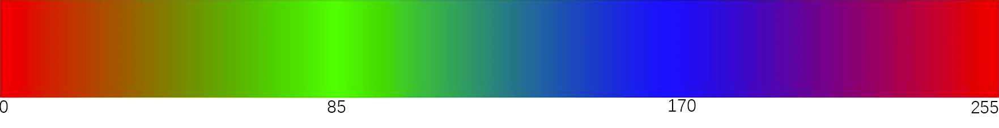

# Freenove WS2812B RGBLED Controller

## Description
This is a Arduino library for Freenove WS2812B RGBLED Controller (Shorter name "Controller").<br />
Although Arduino can directly control WS2812B LED, it needs to shut down all interrupts to ensure normal communication. It's very inconvenient.<br />
The controller solves this problem well. It uses I2C or UART to communicate with Arduino. So you can easily control WS2812B LED through it.<br />
And you can add it to almost all your Arduino projects without affecting them. Make your work look cool!<br />

## Examples:

Here are some simple examples.

### Show Rainbow
This example make your strip show a flowing rainbow.
```
#include "Freenove_WS2812B_RGBLED_Controller.h"

#define I2C_ADDRESS  0x20
#define LEDS_COUNT   10

//Freenove_WS2812B_Controller strip(&Serial1, LEDS_COUNT, TYPE_GRB, 115200UL);
Freenove_WS2812B_Controller strip(I2C_ADDRESS, LEDS_COUNT, TYPE_GRB);

void setup() {
  while (!strip.begin());
}

void loop() {
  for (int j = 0; j < 255; j += 2) {
    for (int i = 0; i < LEDS_COUNT; i++) {
      strip.setLedColorData(i, strip.Wheel((i * 256 / LEDS_COUNT + j) & 255));
    }
    strip.show();
    delay(2);
  }  
}
```

## Usage
```
//Freenove_WS2812B_Controller strip(&Serial1, LEDS_COUNT, TYPE_GRB, 115200UL);
Freenove_WS2812B_Controller strip(I2C_ADDRESS, LEDS_COUNT, TYPE_GRB);
```
* Construction. Create a Controller object. The construction parameters determine the communication mode, I2C or UART.

```
strip.begin()
```
* Establish communication with the controller and send the number of LEDs to the controller. Return true successfully or false otherwise.
```
strip.setLedColorData(id, color);
strip.setLedColorData(id, r, g, b);
```
* Send the color data of the specified LED to the controller. 
* Display color change after calling show function.
	* id: the index of led.
	* color: color value. egg, 0xFF0000 is RED color.
	* r,g,b: color value. 0-255.
```
strip.show();
```
* Immediately display the color data that has been sent.


```
strip.setLedColor(id, color);
strip.setLedColor(id, r, g, b);
```
* Send color data and display it immediately.
* It is equivalent to "strip.setLedColorData(id, color); strip.show();"
	* id: the index of led.
	* color: color value. egg, 0xFF0000 is RED color.
	* r,g,b: color value. 0-255.

```
strip.Wheel(i)
```
* A simple color picker.
	* i: 0-255.


